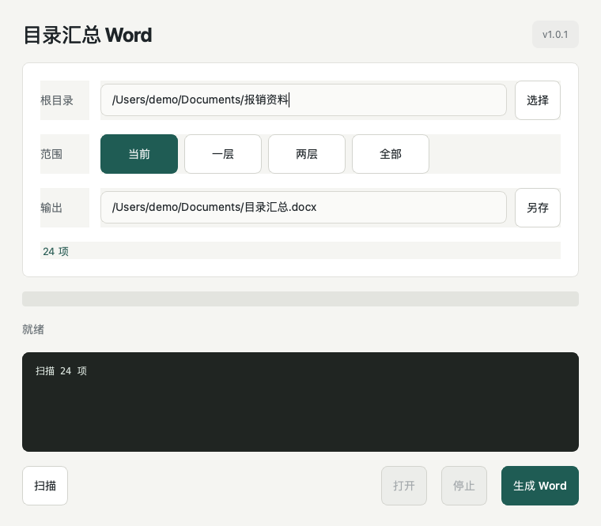

# FolderWordMaker / 目录汇总 Word

A clean desktop app for merging every image and PDF page under a folder into one Word document.

一个简洁的桌面工具：选择根目录，按层级扫描图片和 PDF，然后把它们汇总进一个 Word。



## Features

- Folder-based scanning for images and PDFs
- Depth modes: current folder, one level, two levels, all levels
- One image or PDF page per Word page
- Automatic portrait/landscape page fitting without cropping
- Visible scan and build log
- Cross-platform source for macOS and Windows
- Simple desktop UI built with PySide6

## Download

Use the latest GitHub Release for packaged builds.

## Run From Source

macOS:

```bash
python3 -m venv .venv
source .venv/bin/activate
pip install -r requirements.txt
python run_app.py
```

Windows:

```bat
py -m venv .venv
.venv\Scripts\activate
pip install -r requirements.txt
python run_app.py
```

## Build

macOS:

```bash
scripts/build_mac.command
```

Windows:

```bat
scripts\build_windows.bat
```

Build outputs are created in `dist/`.

## Supported Files

Images: `jpg`, `jpeg`, `png`, `heic`, `heif`, `webp`, `bmp`, `tif`, `tiff`

Documents: `pdf`

## License

MIT
